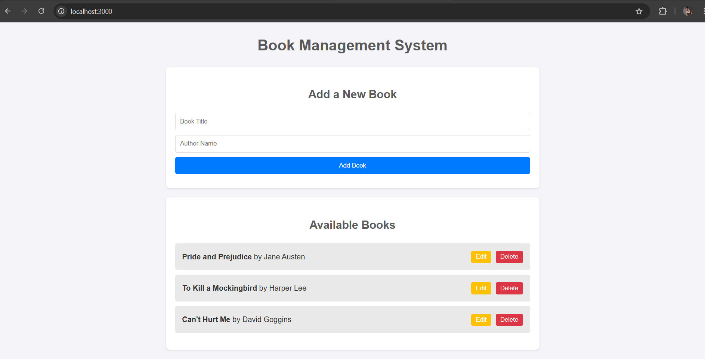
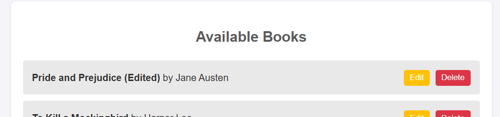
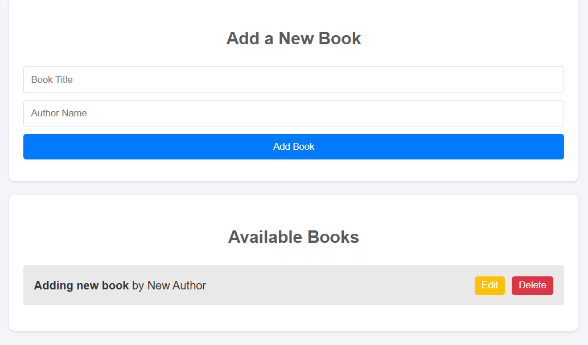

# Book Management System

A simple, full-stack application for managing a list of books.

## 📚 Project Overview

This project is a RESTful API and a front-end user interface that work together to perform **CRUD** (Create, Read, Update, Delete) operations on a list of books. The back-end is built with **Node.js** and the **Express** framework, while the front-end uses plain **HTML**, **CSS**, and **JavaScript**. The data is stored in memory, making it an excellent starting point for understanding how client-server applications function.

## ✨ Features

- **Create**: Add new books to the list via a simple form.
- **Read**: View all books in a formatted list on the front page.
- **Update**: Edit the title and author of an existing book.
- **Delete**: Remove a book from the list with a single click.
- **Responsive UI**: A basic but functional user interface that can be used directly without a separate API testing tool.

## 🚀 Getting Started

### Prerequisites

Make sure you have [Node.js](https://nodejs.org/en/) installed on your machine.

### Installation

1.  **Clone the repository:**
    ```bash
    git clone [https://github.com/ajaymkoli/bookAPI-CRUD_Operations]
    cd bookAPI-CRUD_Operations
    ```
2.  **Install project dependencies:**
    ```bash
    npm install
    ```

### Running the Application

1.  **Start the server:**
    ```bash
    npm start
    ```
    The server will start on `http://localhost:3000`. You'll see a confirmation message in your terminal.

2.  **Access the front end:**
    Open your web browser and navigate to `http://localhost:3000` to interact with the Book Management System.

## 📂 Project Structure

The project is structured to separate back-end logic from front-end assets.

```
bookAPI-CRUD_Operations/
├── public/
│   ├── index.html       # The main front-end page
│   ├── style.css        # Styles for the front-end
│   └── script.js        # Front-end logic for API calls
├── OUTPUT/
│   ├── # Screenshots of the running application
├── package.json         # Project metadata and dependencies
└── server.js            # The Express.js back-end server and API endpoints
```

## 📝 API Endpoints

The back-end API provides the following endpoints:

| Method | Endpoint         | Description                   | Request Body                       |
| :----- | :--------------- | :---------------------------- | :--------------------------------- |
| `GET`  | `/books`         | Retrieves all books.          | None                               |
| `GET`  | `/books/:id`     | Retrieves a single book by ID.| None                               |
| `POST` | `/books`         | Adds a new book.              | `{ "title": "", "author": "" }`    |
| `PUT`  | `/books/:id`     | Updates an existing book.     | `{ "title": "", "author": "" }`    |
| `DELETE`|`/books/:id`     | Deletes a book by ID.         | None                               |


## OUTPUT IMAGES
### Dashboard


### Add Book


### Edit Book


### Edited Book



### Delete Books



## 🤝 Contribution

Feel free to fork this repository and contribute. Pull requests are welcome. For major changes, please open an issue first to discuss what you would like to change.


